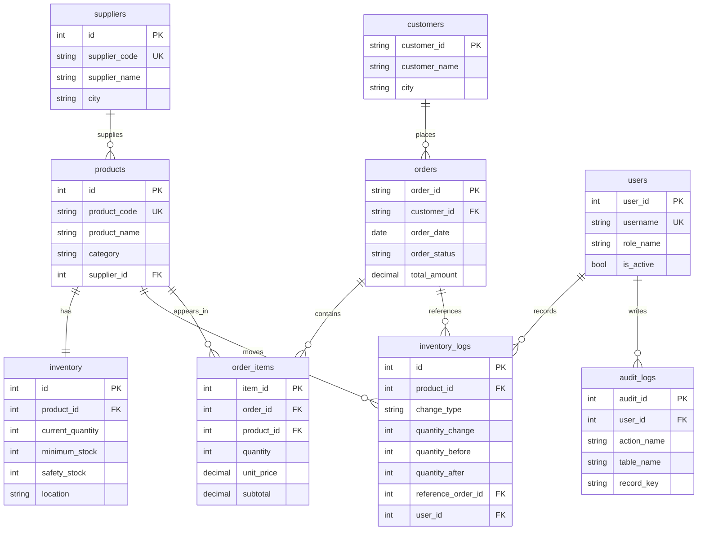

# ERD

This ERD describes the main relational design used by the PostgreSQL demo.

## Notes

- `orders` and `order_items` are separated because one order can contain many products.
- `inventory` stores the current quantity, while `inventory_logs` stores the movement history.
- `users` and `audit_logs` are included as basic design tables. The current demo does not include a login screen.
